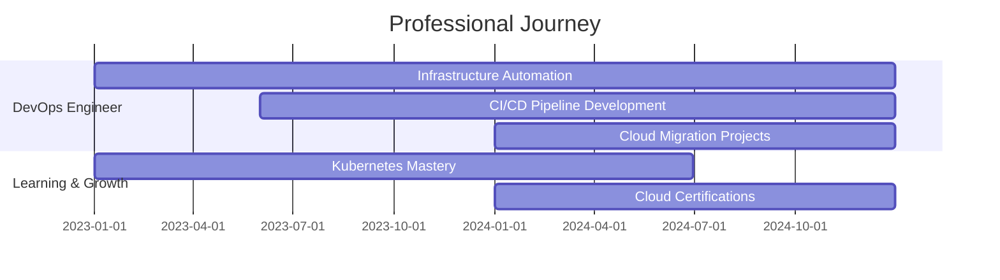

# 👋 Hey there! I'm Harry

  

  

<!-- Alternative cool animations - choose your favorite! -->
<!-- 
  Option 1: Matrix-style coding
  
  
  Option 2: DevOps workflow animation
  
  
  Option 3: Terminal hacking style
  
  
  Option 4: Cyber security theme
  
  
  Option 5: Cloud computing animation
  
  
  Option 6: Data flow visualization
  
-->

  
  
  
  
  
  

---

## 🚀 About Me

  <table>
    <tr>
      <td align="center" width="50%">
        
      </td>
      <td align="left" width="50%">
        <h3>🎯 Who Am I?</h3>
        

          
            
          🌟 <strong>Passionate DevOps Engineer</strong> who loves automating everything! 
          ☁️ <strong>Cloud enthusiast</strong> living in the world of AWS & Azure 
          🔧 <strong>Automation lover</strong> - if it's repetitive, I'll automate it 
          🏋️‍♂️ <strong>Gym rat</strong> who believes in strong body, strong mind, strong code 
          📚 <strong>Continuous learner</strong> always exploring new technologies
        

      </td>
    </tr>
  </table>

  <h3>🔥 My Expertise Areas</h3>
  <table>
    <tr>
      <td align="center" width="25%">
        
         <strong>Cloud Architecture</strong>
         AWS • Azure • Multi-Cloud
      </td>
      <td align="center" width="25%">
        
         <strong>Container Orchestration</strong>
         Kubernetes • Docker • Helm
      </td>
      <td align="center" width="25%">
        
         <strong>CI/CD Pipelines</strong>
         Jenkins • GitLab CI • GitHub Actions
      </td>
      <td align="center" width="25%">
        
         <strong>Infrastructure as Code</strong>
         Terraform • Ansible • CloudFormation
      </td>
    </tr>
  </table>

  <h3>🎯 Current Focus & Goals</h3>
  
  
  
  
  
  
  

---

## 🎯 Current Focus

<table>
  <tr>
    <td align="center" width="50%">
      
    </td>
    <td align="center" width="50%">
      
    </td>
  </tr>
</table>

  <h3>🔭 Working on: Ultimate Corporate CICD DevOps Project</h3>
  <h3>🌱 Learning: Advanced DevOps Tools and Multi-Cloud Platforms</h3>
  <h3>👯 Open to collaborate on: Python Web Application CI/CD Pipelines</h3>

---

## 🛠️ Tech Arsenal

### 🏗️ Infrastructure & DevOps

  

### 💻 Programming & Development

  

### 🗄️ Databases & Tools

  

### ☁️ Cloud & Platforms

  

---

## 📊 GitHub Analytics

  
  

  

---

## 🏆 GitHub Trophies

  

---

## 💼 Professional Experience

---

## 🎖️ Certifications & Achievements

  
  
  
  
  
  

---

## 🌟 Featured Projects

  
  
  
  

---

## 📈 Contribution Graph

  

---

## 🎯 GitHub Activity & Contributions

  

<!-- If snake animation doesn't work, use this instead -->

  

  

---

## 💡 Fun Facts

  

- 🏋️‍♂️ **Gym Enthusiast**: I believe in strong body, strong mind, strong code!
- 🤖 **Automation Lover**: If it can be automated, it should be automated
- ☁️ **Cloud Native**: Living in the cloud, literally and figuratively
- 🔧 **Tool Creator**: Building tools that make developers' lives easier
- 📚 **Continuous Learner**: Always exploring new technologies and methodologies

---

## 📫 Let's Connect!

  
  
  
  
  
  
  

---

  <h3>⚡ "Automating the world, one pipeline at a time!" ⚡</h3>
  

---

  <i>Happy Coding! 😊</i>

