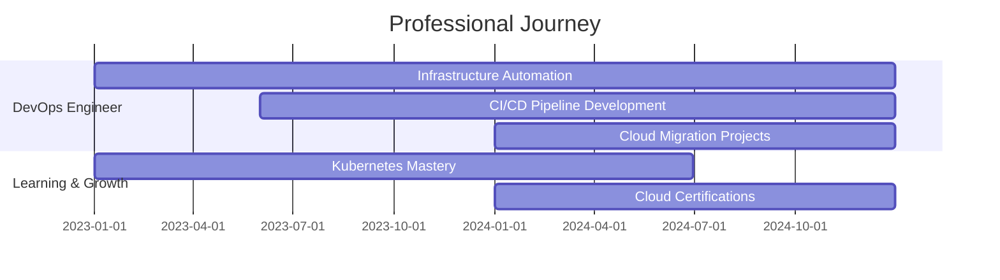

# 👋 Hey there! I'm Harry

<div align="center">
  
</div>

<div align="center">
  
</div>

<div align="center">
  
  
  [](https://linkedin.com/in/www.linkedin.com/in/harinther)
  [](https://twitter.com/harintherhr3)
  [](https://instagram.com/harry_hr__)
  
</div>

---

## 🚀 About Me

```yaml
name: Harry
located_in: DevOps Universe
current_focus: Cloud Infrastructure & Automation
education: 
  - "Self-taught DevOps Engineer"
  - "Continuous learner"
  - "Problem solver"

fields_of_interests:
  - "Cloud Architecture"
  - "Container Orchestration"
  - "CI/CD Pipelines"
  - "Infrastructure as Code"
  - "Monitoring & Observability"
  
currently_learning: ["Advanced Kubernetes", "Cloud Security", "GitOps"]
2024_goals: ["Contribute to Open Source", "Build DevOps Community", "Master Cloud Platforms"]
hobbies: ["Gym 💪", "Tech Blogging", "Automation Scripts"]
```

---

## 🎯 Current Focus

<table>
  <tr>
    <td align="center" width="50%">
      
    </td>
    <td align="center" width="50%">
      
    </td>
  </tr>
</table>

<div align="center">
  <h3>🔭 Working on: Ultimate Corporate CICD DevOps Project</h3>
  <h3>🌱 Learning: Advanced DevOps Tools and Multi-Cloud Platforms</h3>
  <h3>👯 Open to collaborate on: Python Web Application CI/CD Pipelines</h3>
</div>

---

## 🛠️ Tech Arsenal

### 🏗️ Infrastructure & DevOps
<div align="center">
  
</div>

### 💻 Programming & Development
<div align="center">
  
</div>

### 🗄️ Databases & Tools
<div align="center">
  
</div>

### ☁️ Cloud & Platforms
<div align="center">
  
</div>

---

## 📊 GitHub Analytics

<div align="center">
  
  
</div>

<div align="center">
  
</div>

---

## 🏆 GitHub Trophies

<div align="center">
  
</div>

---

## 💼 Professional Experience



---

## 🎖️ Certifications & Achievements

<div align="center">
  
  
  
  
  
  
</div>

---

## 🌟 Featured Projects

<div align="center">
  
  [](https://github.com/HarryDevOps1019/Task-Master-Pro)
  [](https://github.com/HarryDevOps1019/python-demoapp)
  
</div>

---

## 📈 Contribution Graph

<div align="center">
  
</div>

---

## 🐍 Watch my contributions get eaten by a snake 🐍

<div align="center">
  
</div>

---

## 💡 Fun Facts

<div align="center">
  
</div>

- 🏋️‍♂️ **Gym Enthusiast**: I believe in strong body, strong mind, strong code!
- 🤖 **Automation Lover**: If it can be automated, it should be automated
- ☁️ **Cloud Native**: Living in the cloud, literally and figuratively
- 🔧 **Tool Creator**: Building tools that make developers' lives easier
- 📚 **Continuous Learner**: Always exploring new technologies and methodologies

---

## 📫 Let's Connect!

<div align="center">
  
  [](mailto:harintherhr3@gmail.com)
  [](https://linkedin.com/in/www.linkedin.com/in/harinther)
  [](https://twitter.com/harintherhr3)
  [](https://instagram.com/harry_hr__)
  [](https://github.com/HarryDevOps1019)
  
</div>

---

<div align="center">
  <h3>⚡ "Automating the world, one pipeline at a time!" ⚡</h3>
  
</div>

---

<div align="center">
  <i>Happy Coding! 😊</i>
</div>
